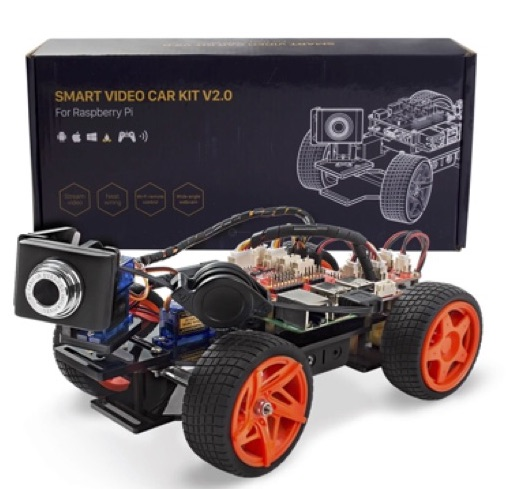
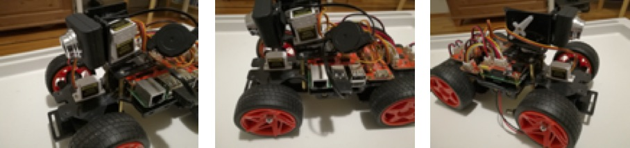
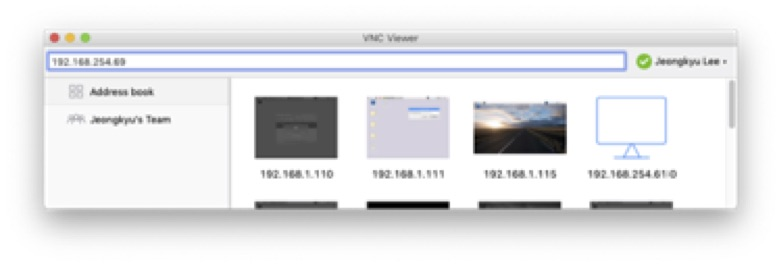
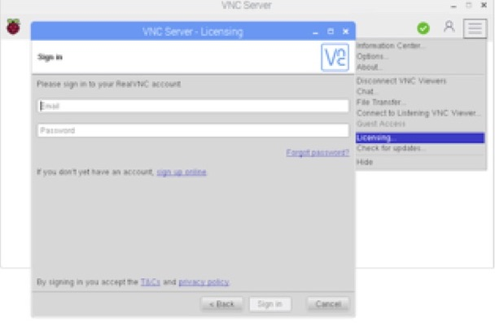
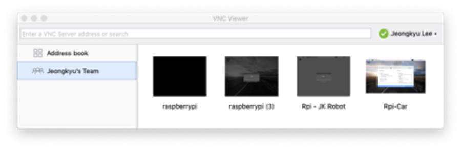
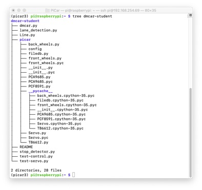
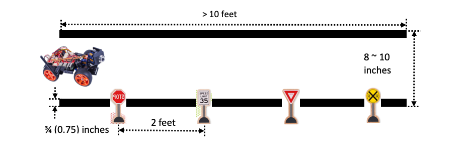
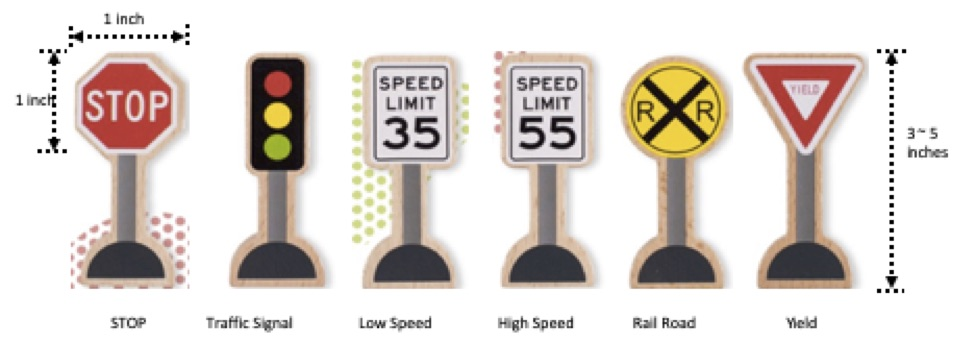
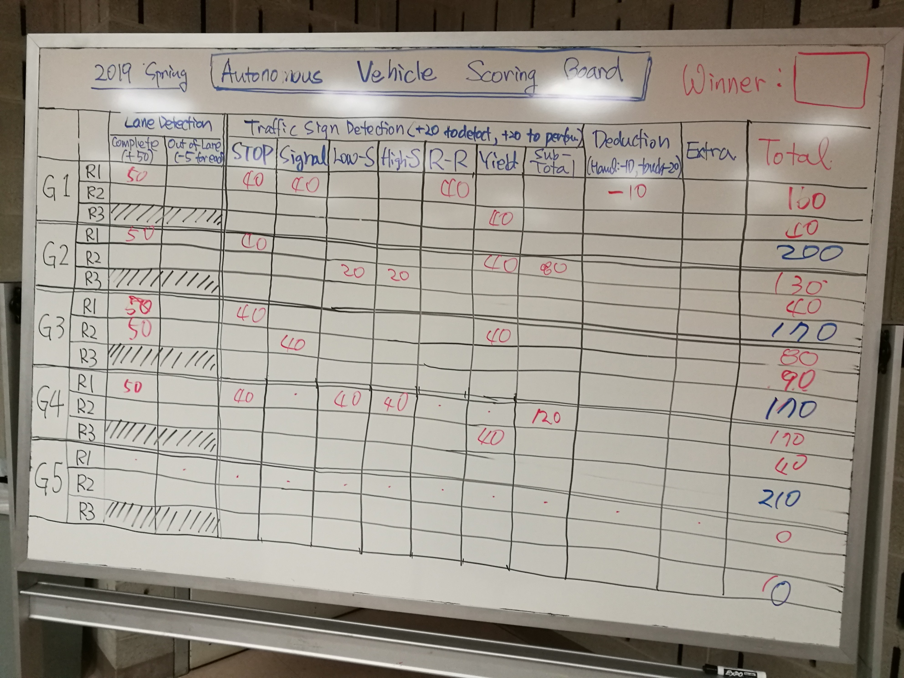

# Autonomous Car using Data Mining: Deep Learning
Autonomous Car project in CPSC552 Data Mining at University of Bridgeport

**Objectives**:
1.  Understanding Data Mining Techniques and Deep Learning
2.  Become familiar with Python, Keras, Tensorflow and OpenCV
3.  Gain experience with research on autonomous vehicle and data mining

This will be a group project by three (3) students for one semester. The
main purpose of this project is to become familiar with data mining
techniques, specifically Convolutional Neural Network (CNN), and to
apply them to real world problems, i.e., autonomous vehicle. You need to
follow the instruction to conduct the project.

[](https://www.youtube.com/watch?v=QPpzqjuDxwU)


### Porject Groups in Spring 2019
**Group 1**: https://github.com/DivyaSamragniNadakuditi/DM-Car

**Group 2**: https://github.com/ub-data-miners-2/dmcar
             https://github.com/ub-data-miners-2/traffic-sign-net

**Group 3**: https://github.com/uteegull/DM_Car

**Group 4**: https://github.com/DOWmad/PiCar_Project

**Group 5**: https://github.com/gunasai/DM-Car-Team5

Note: All files that are necessary in this project are available at
class GitHub site
<https://github.com/jaykay0408/Auto-Car-Data-Mining>

## Phase 1: Assembly an Autonomous Vehicle

As an autonomous vehicle for this project, we are going to use "Smart
Video Car Kit V2.0 for Raspberry Pi" as below:
-   Model: Sunfounder Smart Video Car Kit V2.0 for Raspberry Pi
-   Name in this project: DM-Car
-   URL: <https://www.sunfounder.com/smart-video-car-kit-v2-0.html>



You can assembly a car using the instruction included in a box. However,
the quality of printed images is not clear, so you should be very
careful to assembly the car. The only difference point is the location
of camera. In order to provide a wide angle of camera, you can setup a
camera in a middle of body (instead of the front) as shown in a figure
below.


Note that pan and tilt servos for a camera will not be used for the
project. However, you still need to install them to mount a camera
correctly.

***Homework: Submit the followings:***
-   At least 10 photos that describe the process of assembly
-   Any ideas to improve the quality of dmcar?
-   Submission: Canvas

## Phase 2: Setting-Up Raspberry Pi

DM-Car has 3 PCB as below:
-   Robot HATS: Connecting Raspberry Pi into controllers
-   PCA 9685 PWM Driver: controlling 1 servos for front steering wheel
    and 2 servos for pan and tilt of a camera
-   TB6612 Motor Driver: controlling 2 servos for back wheels

In this project, we are going to use Raspberry Pi 3 model B+ to control
servos using Python. Due to the limited time, an instructor will provide
pre-configured raspbian OS image. Please, follow the instructions below
to setup Raspberry Pi.

Note that if an instructor provides pre-configured SD Card, move to Step
3 (i.e., Skip Step 1 and Step 2)

**Step 1**: Download pre-configured raspbian OS image
-   Instructor will provide the link to download, or

**Step 2**: Create SD card for Raspberry Pi using downloaded image
-   Write a downloaded image into SD card using proper software
    -   See the following link for more details:
        <https://www.raspberrypi.org/documentation/installation/installing-images/README.md>
-   Add the following two files to connect wi-fi (skip this if you use
    Option 1 in Step3)
    -   ssh: no contents inside
    -   wpa\_supplicant.conf: edit contents for proper wifi info.
        Otherwise, you can download 2 files from class Github

**Step 3**: Connect to Raspberry Pi using VNC viewer
-   ***Option 1***: directly setup wi-fi using a mice, a keyboard and a
    monitor (HDMI)
    -   Use this option if you have the followings:
        -   USB mouse
        -   USB keyboard, and
        -   Monitor with HDMI adaptor
    -   Configure wi-fi setting like any other computer
-   ***Option 2***: direct connection using VNC viewer
    -   Use this option if you are using wi-fi under the followings:
        -   hot-spot using your cell phone
        -   private router, e.g., router at home
        -   router prepared by an instructor, or
        -   Network that enable/open port number 5900
    -   Install VNC viewer on your PC:
        <https://www.realvnc.com/en/connect/download/viewer/>
    -   Find IP address using a router or IP scan program
        
    -   Enter the IP address on VNC viewer
        -   Username: pi
        -   Password: raspberry
-   ***Option 3***: cloud connection using VNC server
    -   Use this option if you are using wi-fi under the followings:
        -   Enterprise wi-fi network, e.g., knights-wifi at UB campus
        -   WPA2 Enterprise authentication
        -   Network that disable/block port number 5900
    -   Establishing a cloud connection for VNC server on your raspberry
        pi
        -   Sign up for a RealVNC account at
            <https://www.realvnc.com/raspberrypi/#sign-up>
        -   On your Raspberry Pi, sign in to VNC Server using your new
            RealVNC account credentials, i.e., e-mail and password:
            (right click VNC icon on top menu bar -\> click Licensing)
        

    -   Install VNC viewer on your PC:
        <https://www.realvnc.com/en/connect/download/viewer/>
    -   Sign in to VNC Viewer using the same VNC server account credentials
    -   Then either tap or click to connect to your Raspberry Pi
    

**Step 4**: Setup networks if needed

**Step 5**: Update raspbian OS using terminal

    $ sudo apt-get update
    $ sudo apt-get upgrade

***Homework: submit the followings:***
-   Screenshots or photos of each step of setting-up
-   Any ideas to improve the connectivity of picar (i.e., Raspberry Pi)

## Phase 3: Download Programs and Configuration
In order to focus on main goal of the project, i.e., applying a deep
learning algorithm into an autonomous vehicle, an instructor provides a
package of programs and libraries for an autonomous vehicle. DM-Car has
the following functionalities:
-   Straight lane detection
-   Controlling back wheel servos
-   Controlling front steering wheel servo
-   Camera module
-   PID control
-   Creating Video Clip

Download the autonomous vehicle DM-Car program from Github site. First,
login Raspberry Pi using VNC viewer (or ssh).

    $ wget https://github.com/jaykay0408/Auto-Car-Data-Mining/raw/master/dmcar-student.tar
    $ tar xvf dmcar-student.tar

Start virtualenv (name 'picar3')

    $ . ./.profile
    $ workon picar3
    $ dmcar-student

dmcar-student consist of the following files and directory:



-   dmcar.py
    1.  main file to control autonomous car
    2.  To run the program
    ```
    $ python dmcar.py -b 5
    ```
    3.  You need to handle mainly this file to operate DM-Car
-   lane\_detection.py
    1.  functions to detect lanes and PID control
    2.  Line 187: vertices can be modified
-   Line.py
    1.  Line class
-   stop\_detector.py
    1.  test program for stop/non-stop CNN model
        \$ python stop\_detector.py
    2.  You can use this file to test your trained model
-   test-control.py and test-servo.py
    1.  test programs for controlling servos
    2. db\_file: calibration data for each servo
    3. fw = front\_wheels.Front\_Wheels(debug=False, db=db\_file)
        - front wheels contral
        ```
        bw.ready()
        bw.speed = 50
        bw.forward()
        bw.backward()
        bw.stop()
        ```
    4. bw = back\_wheels.Back\_Wheels(debug=False, db=db\_file)
        - back wheels control
        ```
        fw.ready()
        fw.turn_left()
        fw.turn_right()
        fw.turn_straight()
        fw.turn(ANGLE)
        ```
    5. SPEED
        - Speed of DM-Car: range from 0 to 100
        - For testing purpose: 25 \~ 50 
    6. ANGLE
        - 90 (Straight), 45 (45 left), 135 (45 right)
-   picar
    1. directory for servos (2 back wheels and 1 front wheels) in a car
        mostly doesn\'t have to change

***Homework: Submit the followings:***
-   How to improve the lane detection
-   How to improve the controlling front wheels and back wheels motors
    (i.e., servos)
-   Create a video clip that captures moving car following lane

## Phase 4: Creating Training Model for Traffic Signs using CNN

To create training model for traffic signs using CNN, use the Exercise
Lab: Section 5.

Transfer the trained model from your PC into Raspberry Pi in your car
using VNC viewer.
-   Start VNC viewer file transfer
-   Copy the file into /home/pi/dmcar-student
-   If model name is different from "stop\_not\_stop.model", change
    MODEL\_PATH at dmcar.py
```
# define the paths to the Stop/Non-Stop Keras deep learning model
MODEL_PATH = "stop_not_stop.model"
```
-   If you don't have a trained model, you can use a default model
    "stop\_not\_stop.model" by downloading from class GitHub
```
    $ wget https://github.com/jaykay0408/Auto-Car-Data-Mining/raw/master/stop_not_stop.model
```

***Homework: Submit the followings:***
-   Uploading collected dataset into proper storage, such as Google
    drive or any available shareable storage
-   Then, share the link of uploaded dataset
-   Submit python code to train the models
-   Uploading trained model(s) to Github
-   Answer the following questions:
    1. Image Size
    2. How to design CNN architecture including how many layers, what
        kind of layers, and so on
    3. How to optimize the model including parameter values, drop out,
        backpropagation, learning rate, \# of epoch and so on
    4. Evaluations
    5. How to overcome the limitations in your DM-Car implementation

## Phase 5: Testing Autonomous Vehicle with Pre-Trained Model

In Phase 5 (for the last step), picar will be tested using pre-trained
model in Phase 4 for the following task.



Specification of Testing road
-   Dimensions:
    -   Width: 8 \~ 10 inches (but, 9 inch is suggested)
    -   Length: minimum 10 feet (but, only straight lane)
    -   Surface: any flat area is fine
    -   Color of surface: any color is fine, but not too dark. Also,
        solid and bright color will give the best performance
-   Lane:
    -   Color: black
    -   Width: ¾ inches
    -   All connected and straight lane
    -   Use the vinyl electric tape to create lane as shown below image
-   Traffic signs
    -   Traffic signs and required action when detected
        -   STOP: stop and go
        -   YIELD: slow down and go normal speed
        -   Low SPEED: change speed to low
        -   High SPEED: change speed to high
        -   Traffic Signal: detect traffic signal (no change on picar)
        -   RR (Rail Road): stop and go
    -   Dimensions
        -   Total Hight: 3 \~ 5 inches
        -   Sign: 1 x 1 inches
        -   Setup right-hand side of the road
        -   At least 2 feet between 2 signs
    -   Sample Signs



Your picar should follow the tasks below:

1.  Start
2.  Drive between two lanes
3.  Detect traffic signs
4.  Perform a task for each sign
    -   STOP: stop and go
    -   YIELD: slow down and go normal speed
    -   Low SPEED: change speed to low
    -   High SPEED: change speed to high
    -   Traffic Signal: detect traffic signal (no change on picar)
    -   RR (Rail Road): stop and go
5.  Stop at the end of road

***Homework: Submit the followings***
-   Target traffic signs and their tasks (in addition to defaults)
-   Collected datasets
-   Proposed deep learning models
-   Implementation of the proposed model (i.e., source code)
-   Evaluations
-   Submission
    -   Documenting the following at GitHub, then submit the Github link
        to Canvas
        -   Proposed deep learning model
        -   Regarding dataset
        -   Implementation including source code, trained model and any
            others
        -   Evaluations
    -   Upload dataset into any shareable storage such as google drive
        or Dropbox, then submit the link to Canvas
    -   Submit screenshots and short clips that shows your
        implementation and progress to Canvas

## Phase 6: Final Competition
The final phase of this project is a competition with other teams.
-   When: May 6 \~ May 10 during the final exam week
-   Where: Hallway in Technology Building
-   Rule:
    1.  Each team has 2 trials
    2.  A team who gets the highest point is a winner
    3.  Points
        -   Correct detection for each sign: + 20 points
        -   Perform task for each sign: + 20 points
        -   Successful stop at the end: + 20 points
        -   Out of lane: - 5 points
        -   Unexpected stop or go: - 5 points
        -   Manual operation: - 20 points
        -   Touching a picar: - 40 points

***Homework: Submit the followings:***
-   Video tapping the final competition
-   Edit 2 \~ 3 minutes video
-   Upload the video into YouTube
-   Submit the link

## Final Competition Results in Spring 2019
-   1st Place: Group 4 (total 210 points)
-   2nd Place: Group 1 (total 200 points)
-   3rd Place: Group 2 and Group 3 (total 170 points)
-   5th Place: Group 5 (total 0 point)

***Competition Score Board***


***Group 1: *** 
[](https://www.youtube.com/watch?v=ARyv3zoPBQg)

***Group 2: ***
[](https://www.youtube.com/watch?v=5WzrkDkSn3I)

***Group 3: *** 
[](https://www.youtube.com/watch?v=gJmee2_KKIY)

***Group 4: *** 
[](https://www.youtube.com/watch?v=dYJP_ok2KKk)

***Group 5: ***
[](https://www.youtube.com/watch?v=Z6RLtIVF4qU)


## Phase 7: Final Writing-Up
You must use Github for your documentation
-   Due: Before the final competition day
-   Also, submit 5 minutes final video or Youtube link
-   Submission: Github link to Canvas

**Group 1**: https://github.com/DivyaSamragniNadakuditi/DM-Car

**Group 2**: https://github.com/ub-data-miners-2/dmcar
             https://github.com/ub-data-miners-2/traffic-sign-net

**Group 3**: https://github.com/uteegull/DM_Car

**Group 4**: https://github.com/DOWmad/PiCar_Project

**Group 5**: https://github.com/gunasai/DM-Car-Team5
